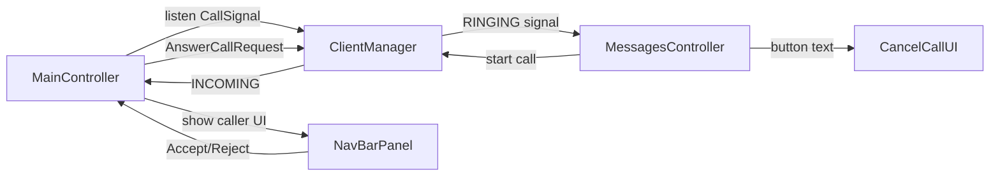

<!-- ba59fb8e-1435-42c7-afd5-63d4fe2ab3b4 -->
---
todos:
  - id: "add-navbar-incoming-ui"
    content: "Add hidden incoming-call controls to main-view nav bar and bind FXML ids"
    status: pending
  - id: "wire-maincontroller-call-listener"
    content: "Listen to CallSignal globally in MainController and handle accept/reject actions"
    status: pending
  - id: "update-messages-cancel-label"
    content: "Switch call button text to Cancel Call during ringing and local reset behavior"
    status: pending
  - id: "add-end-call-skeleton"
    content: "Create EndCallRequest, add RequestType.END_CALL, and add placeholder server route"
    status: pending
  - id: "verify-build-and-basic-flow"
    content: "Compile and manually validate navbar incoming controls and messages call button behavior"
    status: pending
isProject: false
---
# Next Step Plan: Navbar Incoming Call UI + EndCall Skeleton

## Scope
Implement incoming-call controls globally in the nav bar (all pages), keep minimal state (single active incoming signal), and add `END_CALL` request plumbing only.

## Decisions Based on Your Inputs
- No per-peer map for call state.
- No popup; use nav bar UI in `MainController`.
- Skip forced chat refresh.
- Add `END_CALL` request skeleton only; no call-ending behavior yet.

## Implementation Plan

### 1) Add a global incoming-call panel in nav bar
- Update `src/main/resources/app/lockin/lockin/fxml/main-view.fxml` to add a compact panel on the right side of nav bar (left of theme/settings icons):
  - `ProfileAvatar`
  - caller name label
  - `Accept` button
  - `Reject` button
- Keep it hidden by default.

### 2) Wire global call listener in `MainController`
- In `src/main/java/app/lockin/lockin/client/controllers/MainController.java`:
  - Register `ClientManager.addCallSignalListener(...)` once.
  - Track one active incoming signal fields (e.g. `activeIncomingCallId`, `activeIncomingCaller`).
  - On `CallSignalType.INCOMING`, show navbar panel and fill avatar/name.
  - On `CallSignalType.ANSWERED`, hide panel if it matches active call.
- Add button handlers in `MainController`:
  - Accept -> `clientManager.answerCall(callId, true)`
  - Reject -> `clientManager.answerCall(callId, false)`
  - Hide panel after response success (or keep visible and show error text on failure).

### 3) Keep Messages view call controls consistent (minimal)
- In `src/main/java/app/lockin/lockin/client/controllers/MessagesController.java`:
  - When local user starts a call and server returns/streams `RINGING`, button text becomes `Cancel Call`.
  - Since end-call behavior is not implemented yet, clicking `Cancel Call` only resets local UI state for now.
  - Keep current common-chat exclusion for call button.

### 4) Add `END_CALL` request skeleton only
- Add new enum value in `src/main/java/app/lockin/lockin/common/requests/RequestType.java`: `END_CALL`.
- Add request class `src/main/java/app/lockin/lockin/common/requests/EndCallRequest.java` with minimal fields:
  - `callId`
  - `getType()` returns `END_CALL`
- In server routing (`ClientHandler` switch), add case branch returning a placeholder error/success response (no real behavior yet).
- No `CallHandler` end logic yet.

## Data Flow (minimal)

## Files Expected to Change
- `src/main/resources/app/lockin/lockin/fxml/main-view.fxml`
- `src/main/java/app/lockin/lockin/client/controllers/MainController.java`
- `src/main/java/app/lockin/lockin/client/controllers/MessagesController.java`
- `src/main/java/app/lockin/lockin/common/requests/RequestType.java`
- `src/main/java/app/lockin/lockin/common/requests/EndCallRequest.java` (new)
- `src/main/java/app/lockin/lockin/server/handlers/ClientHandler.java`

## Verification
- Build: `./gradlew compileJava`
- Manual checks:
  - Incoming call while on Home/Profile shows navbar panel with caller and buttons.
  - Accept/Reject from navbar sends answer request and hides panel.
  - In messages view, outgoing call shows `Cancel Call` during ringing.
  - Common chat still has no call button.
  - `END_CALL` request compiles and routes to placeholder response.
